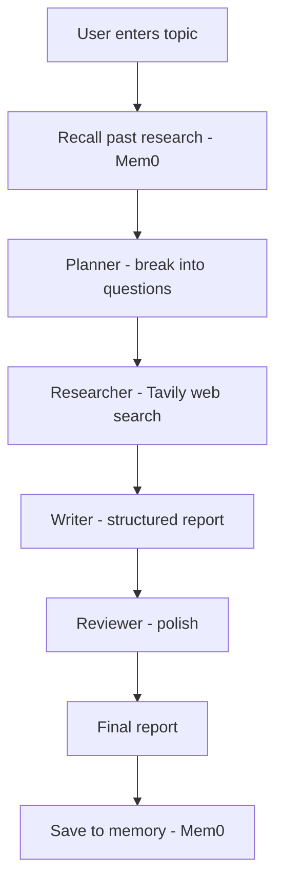
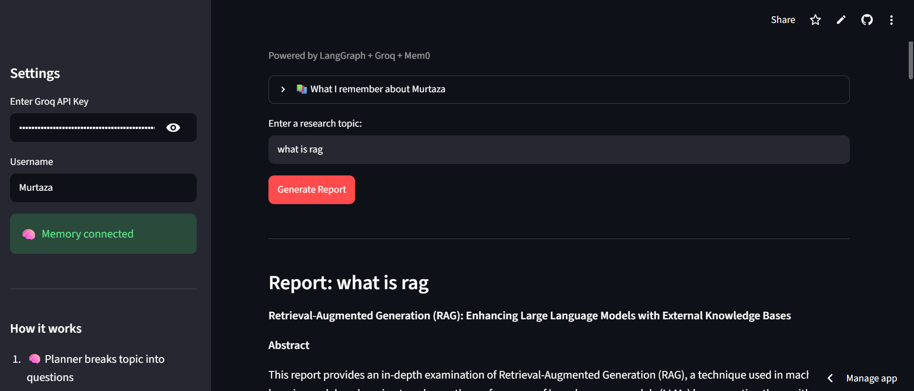
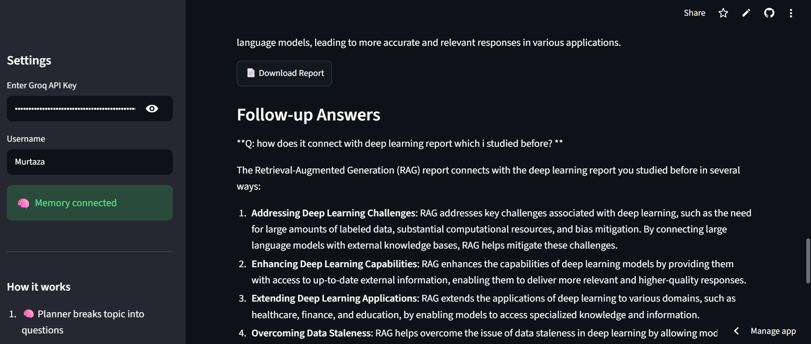

# 🔍 AI Research Assistant — Multi-Agent + Persistent Memory

An intelligent research assistant that takes any topic, researches the web, and generates a structured report using a 4-agent LangGraph pipeline. With Mem0, it remembers your research across sessions.

## 🚀 Live Demo

**👉 [Click here to try the app](https://ai-research-assistant-i2ep8ufovhkbpcxnrzawdy.streamlit.app/)**

## 📌 The Business Problem
Researching a topic properly means searching the web, reading multiple sources, organizing findings, and writing it up — slow, manual work. **This assistant automates the whole research-to-report process** with a team of specialized agents, and remembers what you researched before so it builds on past work instead of starting over.

## 🏗️ Architecture



## ⚙️ The 4-Agent Pipeline
1. **Planner** — breaks the topic into 3 specific research questions
2. **Researcher** — searches the web using Tavily
3. **Writer** — writes a structured report (Introduction, Key Findings, Conclusion)
4. **Reviewer** — improves and polishes the final report

## 🧠 Two Memory Layers
- **Short-term** — follow-ups have the full report context within a session
- **Long-term (Mem0)** — research is saved per user and recalled in future sessions, even on different days

## ✅ Results / What It Does
- **4-agent pipeline** orchestrated with LangGraph
- **Persistent cross-session memory** (Mem0) — reports build on your past research
- **Real-time web search** via Tavily
- Follow-up questions with full context; downloadable reports

## 📸 Screenshots

**Generated report**



<br>

**Memory recall across sessions**



<br>

## 🛠️ Tech Stack
- **Orchestration:** LangGraph (4-agent pipeline)
- **LLM:** Groq + GPT-OSS 120B
- **Memory:** Mem0 (persistent, cross-session)
- **Web Search:** Tavily
- **Framework:** LangChain
- **Frontend:** Streamlit

## ▶️ Run Locally
1. Clone the repo:
```
git clone https://github.com/Murtaza-data/ai-research-assistant.git
cd ai-research-assistant
```
2. Install dependencies:
```
pip install -r requirements.txt
```
3. Add Tavily and Mem0 keys to `.streamlit/secrets.toml`, enter your Groq key in the sidebar
4. Run the app:
```
streamlit run app.py
```
